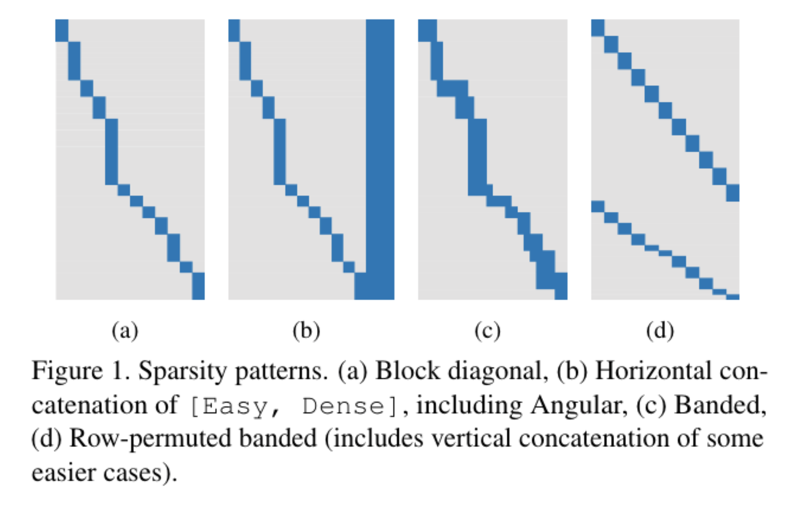
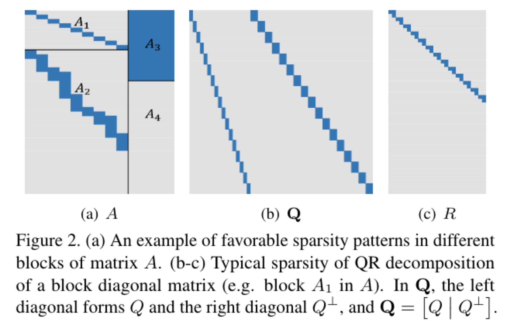
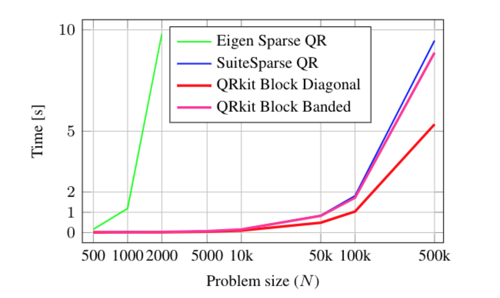
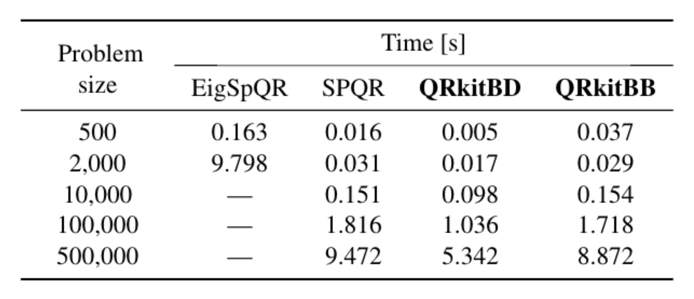

# QRKit

This repository contains implementation of our WACV 2018 work [QRkit: Sparse, Composable QR Decompositions for Efficient and Stable Solutions to Problems in Computer Vision
](https://arxiv.org/abs/1802.03773).

QRKit is an extension of Eigen C++ library that allows for efficient QR decomposition of sparse matrices with common sparsity patterns.

## Building
```sh
$ cp user.cmake.in user.cmake
$ vi user.cmake # Edit user.cmake to point to your Eigen distro
$ mkdir build
$ cd build
$ cmake ..
$ cmake --build .
```

## Common sparsity patterns
The common sparsity patterns QRKit can bring significant speed-up for are shown below.
<p float="left">


</p>

## Benchmark
A simple benchmark showing speed-up potential of QRKit for matrix with a block-diagonal sparsity pattern.
<p float="left">


</p>

## Reference
If you make any use of our code or data, please cite the following:
```
@conference{svoboda2018qrkit,
  title={QRkit: Sparse, Composable QR Decompositions for Efficient and Stable Solutions to Problems in Computer Vision}, 
  author={Svoboda, J. and Cashman, T. J. and Fitzgibbon, A. W.},
  booktitle={2018 IEEE Winter Conference on Applications of Computer Vision (WACV)}, 
  year={2018},
}
```

## Acknowledgments
For any reuse and or redistribution of the code in this repository please follow the [license agreement](./LICENSE) attached to this repository.


